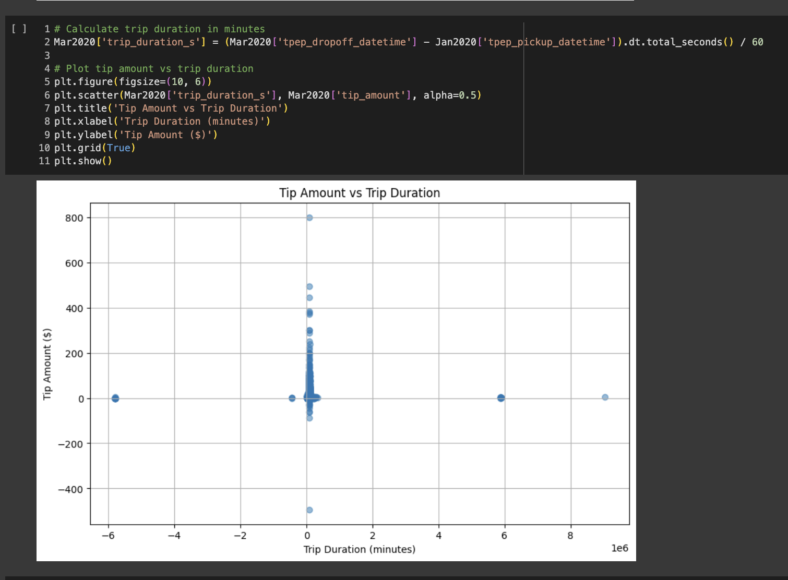
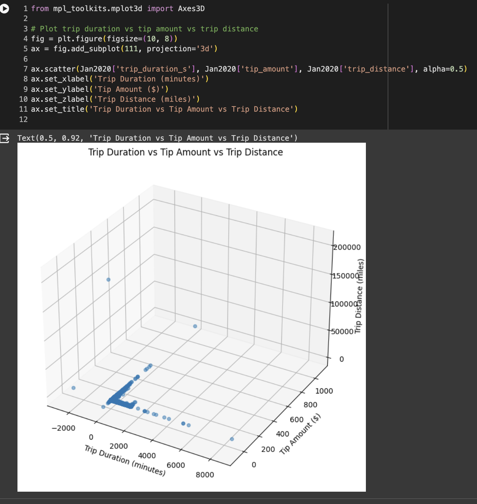
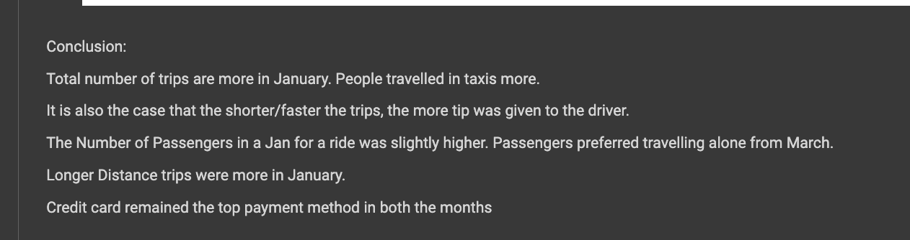

# NYC-Taxi-Data-Analysis

## Overview
This Exploratory Data analysis about the NYC Yellow taxis Data is from the year 2020. The object is to gain insights about the records in the month of January, March and May 2020 (year of Pandemic)

Source : https://www1.nyc.gov/site/tlc/about/tlc-trip-record-data.page

## Key Features

- Data preprocessing: Cleaning and preparing the dataset for analysis.
- Data visualization: Utilizing pandas, matplotlib, seaborn, TFDV libraries to create insightful visualizations of taxi records.
- Insights generation: Analyzing the visualized data to derive insights. 

## Technologies Used

- Python
- Pandas
- Matplotlib
- Seaborn
- Tensorflow Data Validation

# Techniques

Data Extraction, Data Cleaning, Exploratory Data Analysis, Statistical Analysis, Visualizations

